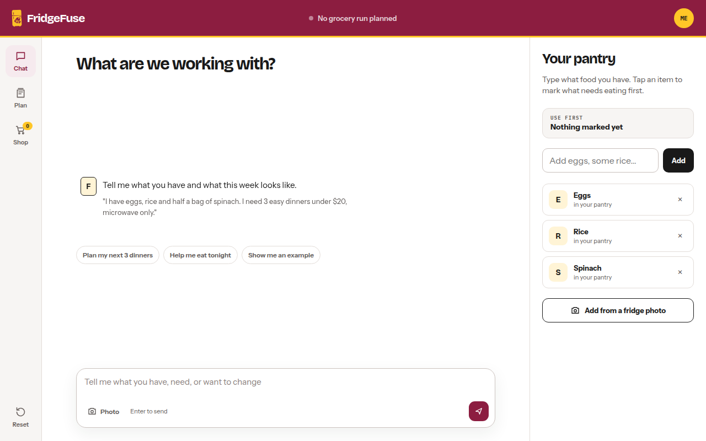

# FridgeFuse

FridgeFuse helps students plan meals using the food they have, their budget, and available cooking equipment.

[Open FridgeFuse](https://fridgefuse.vercel.app/)

## How it works

- Add pantry items by typing or taking a photo.
- Set a budget, diet, and available equipment.
- Chat for dinner ideas and build a meal plan.
- Use Shop to compare estimated grocery costs using current store prices.

## Why we built it

We built FridgeFuse for the ASU AIR SPARK challenge to help students plan meals around limited space, tools, and money.
